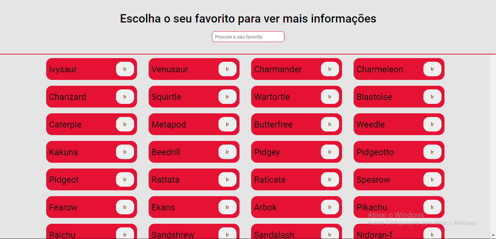
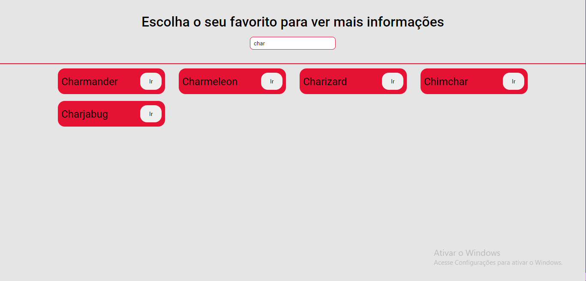
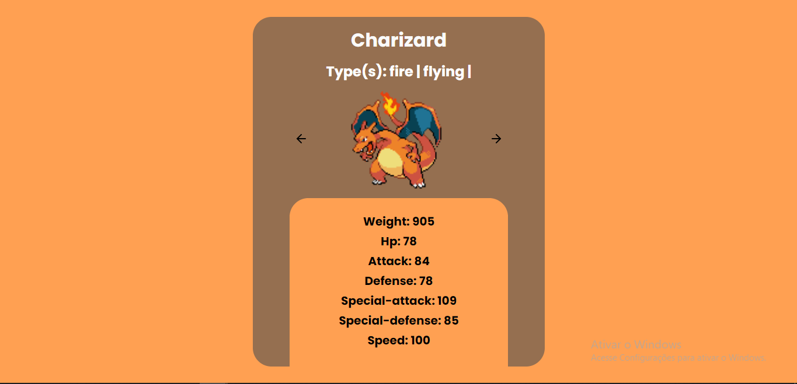
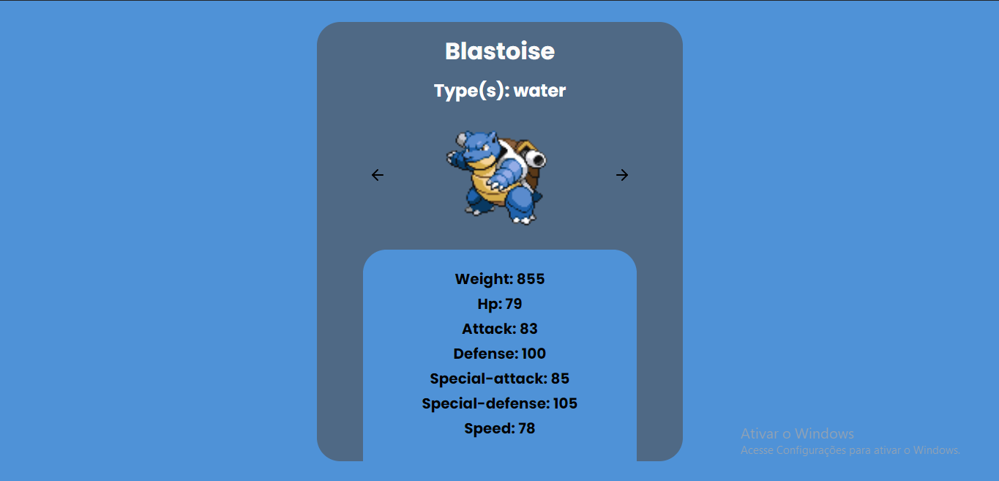
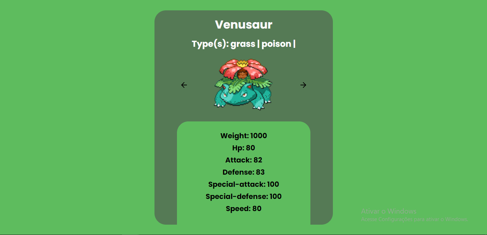

<div align="center">
  <h1>Poke Stats</h1>
</div>
<hr/>

<h2 align="center" >Usando Poke API para treinar consumo de API externas</h2>
<h3 align="center">Nada melhor do que estudar com o que a gente já assitiu ou ainda assite né?!🌎</h3>
<hr />

<h4 align="center">➡️<a target="_blank" href=""> Em breve faço deploy... </a>⬅️</h4>
<hr/>

<div align="center">


</div>
<hr/>

<h2> 🎬 Tecnologias</h2>
  <p>obs: ainda estou na fase de construção</p>
 
<ul>
  <li><a target="_blank" href="https://reactjs.org/" >React</a> - Código base do projeto.</li>
  <li><a target="_blank" href="https://styled-components.com/" >Styled-components</a> - Masterizar a componetização e estilização no projeto</li>
  <li><a target="_blank" href="https://pokeapi.co/" >API Pokemon - para obter dados e mostrar na aplicação</li>
</ul>
<hr/>

<h2> 🛠 Features</h2>

<p>Alguns dos recursos dessa aplicação:</p>

-   [ ] Listar todos os pokemons pela API;
-   [ ] Botão de acesso para mais informações do pokemom selecionado;
-   [ ] Background muda de acordo com o tipo do pokemon;
-   [ ] Rotas via id do pokemon (poderia ser pelo nome... mass queria testar com id);

<h2> 📬 Visão geral do projeto</h2>

<h3>Home</h3>

<h3>Search</h3>

<h3>Info Charizard</h3>

<h3>Info Blastoise</h3>

<h3>Info Venusaur</h3>


<h2> 📬 Pré requisitos</h2>

Ferramentas necessárias para rodar o projeto na sua máquina:
[Git](https://git-scm.com) e [Node.js](https://nodejs.org/en/). 
Além disto é bom ter um editor para trabalhar com o código como [VSCode](https://code.visualstudio.com/)

<h3> 🚩 Rodando o projeto:</h3>

```bash
# Clone este repositório
$ git clone https://github.com/Igor-Mont/TestApiPoke

# Acesse a pasta do projeto no terminal/cmd
$ cd TestApiPoke

# Instale as dependências usando npm ou yarn
$ npm install
$ yarn

# Execute a aplicação em modo de desenvolvimento
$ npm start
$ yarn start

# O servidor inciará na porta:3000 - acesse http://localhost:3000
```

<!-- <h3>Deploy feito na <a href="https://vercel.com/new?utm_source=github&utm_medium=readme&utm_campaign=next-example">Vercel</a> 🖤</h3> -->
